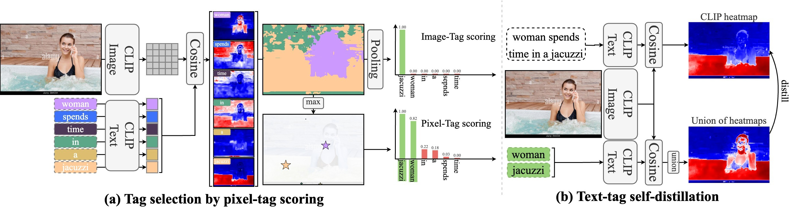
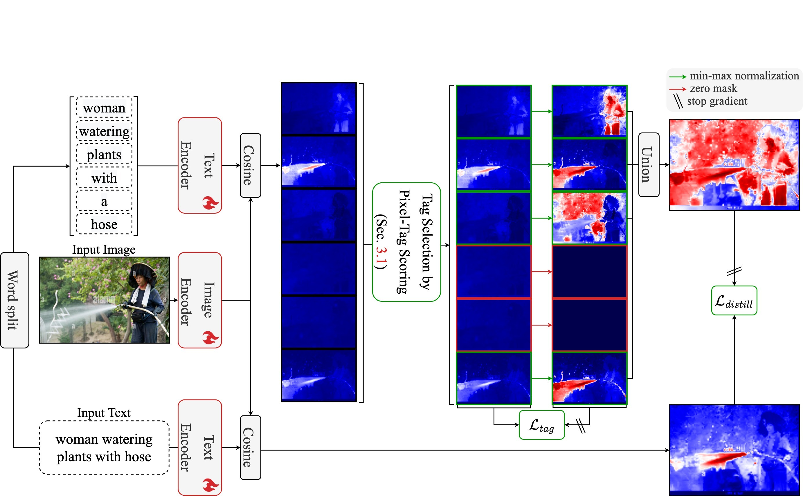

[](https://paperswithcode.com/sota/multi-label-text-classification-on-cc3m?p=ttd-text-tag-self-distillation-enhancing)
[](https://paperswithcode.com/sota/semantic-segmentation-on-cc3m-tagmask?p=ttd-text-tag-self-distillation-enhancing)

# TTD: Text-Tag Self-Distillation Enhancing Image-Text Alignment in CLIP to Alleviate Single Tag Bias
This repository is the official implementation of "TTD: Text-Tag Self-Distillation Enhancing Image-Text Alignment in CLIP to Alleviate Single Tag Bias".

[arXiv](https://arxiv.org/abs/2404.00384)

# Update
[07/02/2024] Our TTD has been accepted to ECCV 2024. 🔥🔥🔥

[04/02/2024] Released initial commits.

### Citation
Please cite our paper if the code is helpful to your research.
```
@misc{jo2024ttd,
      title={TTD: Text-Tag Self-Distillation Enhancing Image-Text Alignment in CLIP to Alleviate Single Tag Bias}, 
      author={Sanghyun Jo and Soohyun Ryu and Sungyub Kim and Eunho Yang and Kyungsu Kim},
      booktitle={European Conference on Computer Vision (ECCV)},
      year={2024}
}
```

### Abstract
We identify a critical bias in contemporary CLIP-based models, which we denote as "single-tag bias". This bias manifests as a disproportionate focus on a singular tag (word) while neglecting other pertinent tags, stemming from CLIP's text embeddings that prioritize one specific tag in image-text relationships. When deconstructing text into individual tags, only one tag tends to have high relevancy with CLIP's image embedding, leading to an imbalanced tag relevancy. This results in an uneven alignment among multiple tags present in the text. To tackle this challenge, we introduce a novel two-step fine-tuning approach. First, our method leverages the similarity between tags and their nearest pixels for scoring, enabling the extraction of image-relevant tags from the text. Second, we present a self-distillation strategy aimed at aligning the combined masks from extracted tags with the text-derived mask. This approach mitigates the single tag bias, thereby significantly improving the alignment of CLIP's model without necessitating additional data or supervision. Our technique demonstrates model-agnostic improvements in multi-tag classification and segmentation tasks, surpassing competing methods that rely on external resources.




# Setup

Setting up for this project involves installing dependencies and preparing datasets. The code is tested on Ubuntu 20.04 with NVIDIA GPUs and CUDA installed. 

### Installing dependencies
To install all dependencies, please run the following:
```bash
pip install -U "ray[default]"
pip install git+https://github.com/lucasb-eyer/pydensecrf.git
python3 -m pip install -r requirements.txt
```

or reproduce our results using docker.
```bash
docker build -t ttd_pytorch:v1.13.1 .
docker run --gpus all -it --rm \
--shm-size 32G --volume="$(pwd):$(pwd)" --workdir="$(pwd)" \
ttd_pytorch:v1.13.1
```

### Preparing datasets (GCC3M+GCC12M)

Create two directories for GCC3M and GCC12M dataset following directory structure.

We provide GCC3M for evaluation with our annotations [[Google Drive](https://drive.google.com/file/d/1Zb2M8YtYe40FuyGA0q-vgQjSCayEizPk/view?usp=sharing)].

```
    ../                               # parent directory
    ├── ./                            # current (project) directory
    │   ├── core/                     # (dir.) implementation of our TTD
    │   ├── tools/                    # (dir.) helper functions
    │   ├── README.md                 # instruction for a reproduction
    │   └── ... some python files ...
    │
    ├── cc3m_for_evaluation/          # GCC3M for evaluation (our benchmark, CC3M-TagMask)
    │   ├── image/
    │   ├── json_refined/             # ground-truth tags for text inputs
    │   └── mask_using_HQ-SAM/        # ground-truth masks for text inputs
    │
    ├── cc3m/                         # GCC3M for training
    │   ├── train/              
    │   │   ├── image/       
    │   │   └── json/
    │   └── validation/
    │       ├── image/
    │       └── json/
    │
    └── cc12m/                        # GCC12M for training
        └── train/              
            ├── image/       
            └── json/
```

### Preparing datasets (Semantic Segmentation)

Please download following VOC, COCO, Context, ADE, and COCO-Stuff datasets. Each dataset has a different directory structure. Therefore, we modify directory structures of all datasets for a comfortable implementation. 

> ##### 1. PASCAL VOC 2012
> Download PASCAL VOC 2012 dataset from our [[Google Drive](https://drive.google.com/file/d/1ITnF19LayDdC1QYUki1guta82L9qSrGo/view?usp=sharing)].

> ##### 2. MS COCO 2014
> Download MS COCO 2014 dataset from our [[Google Drive](https://drive.google.com/file/d/1WwcK-33wHpGw4cozEi7hkmpI0GuYoPEc/view?usp=sharing)].

> ##### 3. Pascal Context
> Download Pascal Context dataset from our [[Google Drive](https://drive.google.com/file/d/1OSMRUjSl-o7u_BMgp83_0PEJMLKue5VJ/view?usp=sharing)].

> ##### 4. ADE 2016
> Download ADE 2016 dataset from our [[Google Drive](https://drive.google.com/file/d/11I9bD1X_6KXh-I3oQTIiUZrPVBlQ56OB/view?usp=sharing)].

> ##### 5. COCO-Stuff
> Download COCO-Stuff dataset from our [[Google Drive](https://drive.google.com/file/d/1tFy3RWy9DsME8cNM8jC-rlsleHF9kySc/view?usp=sharing)].

> ##### 6. Cityscapes
> Download Cityscapes dataset from our [[Google Drive](https://drive.google.com/file/d/1OdzQLZUWh9Z6yeuZHszW9hpqNJKoQSo_/view?usp=sharing)].

Create a directory "../VOC2012/" for storing the dataset and appropriately place each dataset.
```
    ../                               # parent directory
    ├── ./                            # current (project) directory
    │   ├── core/                     # (dir.) implementation of our TTD
    │   ├── tools/                    # (dir.) helper functions
    │   ├── README.md                 # instruction for a reproduction
    │   └── ... some python files ...
    │
    ├── VOC2012/                      # PASCAL VOC 2012 
    │   └── validation/
    │       ├── image/     
    │       ├── mask/        
    │       └── xml/
    │
    ├── COCO2014/                     # MS COCO 2014
    │   └── validation/
    │       ├── image/     
    │       ├── mask/        
    │       └── xml/
    │
    ├── PascalContext/                # PascalContext
    │   └── validation/
    │       ├── image/     
    │       ├── mask/        
    │       └── xml/
    │
    ├── ADE2016/                      # ADE2016
    │   └── validation/
    │       ├── image/     
    │       ├── mask/        
    │       └── xml/
    │
    ├── Cityscapes/                   # Cityscapes
    │   └── validation/
    │       ├── image/     
    │       ├── mask/        
    │       └── xml/
    │
    └── COCO-Stuff/                   # COCO-Stuff
        └── validation/
            ├── image/     
            ├── mask/        
            └── xml/
```

# Preprocessing
Our code is coming soon.

<!-- Calculate image-text similarities on all training datasets for sample-level pruning
```bash
python3 preprocess_caption_similarities.py --gpus 0 --root ../ --data cc3m --arch TCL --image 224 --scales 1.0 --hflip
python3 preprocess_caption_similarities.py --gpus 0 --root ../ --data cc12m --arch TCL --image 224 --scales 1.0 --hflip
```

Merge all scores per caption for sample-level pruning
```bash
python3 preprocess_sample-level_pruning.py --data cc3m --domain train --arch TCL
python3 preprocess_sample-level_pruning.py --data cc12m --domain train --arch TCL
``` -->

# Training
Our code is coming soon.

<!-- Train TCL with our method, TTD.
```bash
CUDA_VISIBLE_DEVICES=0 python3 train.py --data cc3m+cc12m --arch TCL --scales 1.0 --tag "TCL+TTD"
``` -->

# Visualization
Visualize heatmaps for a wild image.
```bash
python demo.py --arch TCL --tags flame smoke --scales 1.0 0.5 1.5 2.0 --image 448 --pamr --lora "./weights/TCL+TTD.pt"
```


# Evaluation
Release our checkpoint.
| Method  | Checkpoints                  |
|:-------:|:----------------------------:|
| TCL+TTD | [Google Drive](https://drive.google.com/file/d/1_H_OMaPncJ4uzAFSn9Cms6LBzk_oYZCR/view?usp=sharing) |

Evaluate performance for multi-tag selection (input: texts)
```bash
CUDA_VISIBLE_DEVICES=3 python3 produce_tags_from_text.py --root ../cc3m_for_evaluation/ --arch TCL --lora ./weights/TCL+TTD.pt --scales 1.0 --hflip --fixed --stopwords

# [                   NLTK] Precision: 59.8, Recall: 83.7, F1: 69.8, Acc: 79.6
# [              Vicuna-7B] Precision: 44.1, Recall: 71.0, F1: 54.4, Acc: 70.9 
# [             Vicuna-33B] Precision: 52.7, Recall: 70.7, F1: 60.4, Acc: 75.9 
# [               Qwen-72B] Precision: 69.3, Recall: 56.2, F1: 62.1, Acc: 80.9
# ----------------------------------------------------------------------------
# [    TCL_224_[1.0]@image] Precision: 92.5, Recall: 28.6, F1: 43.7, Acc: 79.5
# [     TCL_224_[1.0]@text] Precision: 85.6, Recall: 29.7, F1: 44.1, Acc: 79.0
# [    TCL_224_[1.0]@pixel] Precision: 82.9, Recall: 74.5, F1: 78.5, Acc: 88.6
# [TCL_224_[1.0]@pixel+TTD] Precision: 88.3, Recall: 78.0, F1: 82.8, Acc: 91.0
python3 evaluate_classification.py --root ../cc3m_for_evaluation/ --arch "TCL_224_[1.0]@pixel+TTD"
```

Evaluate performance for text-level semantic segmentation (input: texts)
```bash
python3 produce_masks_from_text.py --gpus 0 --root ../ --data CC3M --arch TCL --bg 0.40 --scales 1.0 0.5 1.5 2.0 --hflip --pamr --lora ./weights/TCL+TTD.pt

#             TCL | Caption IoU: 60.4%, mFPR: 0.199, mFNR: 0.198
#         TCL+TTD | Caption IoU: 65.5%, mFPR: 0.163, mFNR: 0.182
python3 evaluate_segmentation_for_text.py --pred "./results_caption/TCL@CC3M@OpenAI@[1.0, 0.5, 1.5, 2.0]@448@s=2@hflip@pamr@TTD@bg=0.40/" --tag TCL+TTD
```

Evaluate performance for open-vocabulary semantic segmentation (input: tags)
```bash
python3 produce_masks_from_tags.py --gpus 0 --root ../ --data VOC2012 --arch TCL --bg 0.40 --scales 1.0 0.5 1.5 2.0 --hflip --pamr --lora ./weights/TCL+TTD.pt
python3 produce_masks_from_tags.py --gpus 0 --root ../ --data COCO2014 --arch TCL --bg 0.45 --scales 1.0 0.5 1.5 2.0 --hflip --pamr --lora ./weights/TCL+TTD.pt
python3 produce_masks_from_tags.py --gpus 0 --root ../ --data ADE2016 --arch TCL --bg 0.45 --scales 1.0 0.5 1.5 2.0 --hflip --pamr --lora ./weights/TCL+TTD.pt
python3 produce_masks_from_tags.py --gpus 0 --root ../ --data Cityscapes --arch TCL --bg 0.40 --scales 1.0 0.5 1.5 2.0 --hflip --pamr --lora ./weights/TCL+TTD.pt
python3 produce_masks_from_tags.py --gpus 0 --root ../ --data COCO-Stuff --arch TCL --bg 0.40 --scales 1.0 0.5 1.5 2.0 --hflip --pamr --lora ./weights/TCL+TTD.pt
python3 produce_masks_from_tags.py --gpus 0 --root ../ --data PascalContext --arch TCL --bg 0.45 --scales 1.0 0.5 1.5 2.0 --hflip --pamr --lora ./weights/TCL+TTD.pt

#       TCL@VOC2012@Ours | mIoU: 61.1%, mFPR: 0.185, mFNR: 0.204
#      TCL@COCO2014@Ours | mIoU: 37.4%, mFPR: 0.350, mFNR: 0.276
#       TCL@ADE2016@Ours | mIoU: 17.0%, mFPR: 0.361, mFNR: 0.468
#    TCL@Cityscapes@Ours | mIoU: 27.0%, mFPR: 0.248, mFNR: 0.483
#    TCL@COCO-Stuff@Ours | mIoU: 23.7%, mFPR: 0.430, mFNR: 0.333
# TCL@PascalContext@Ours | mIoU: 37.4%, mFPR: 0.389, mFNR: 0.237
python3 evaluate_segmentation.py --data VOC2012 --pred "./results/TCL@VOC2012@OpenAI@[1.0, 0.5, 1.5, 2.0]@448@s=2@hflip@pamr@TTD@bg=0.40/" --tag "TCL+TTD@VOC2012"
python3 evaluate_segmentation.py --data COCO2014 --pred "./results/TCL@COCO2014@OpenAI@[1.0, 0.5, 1.5, 2.0]@448@s=2@hflip@pamr@TTD@bg=0.45/" --tag "TCL+TTD@COCO2014"
python3 evaluate_segmentation.py --data ADE2016 --pred "./results/TCL@ADE2016@OpenAI@[1.0, 0.5, 1.5, 2.0]@448@s=2@hflip@pamr@TTD@bg=0.45/" --tag "TCL+TTD@ADE2016"
python3 evaluate_segmentation.py --data Cityscapes --pred "./results/TCL@Cityscapes@OpenAI@[1.0, 0.5, 1.5, 2.0]@448@s=2@hflip@pamr@TTD@bg=0.40/" --tag "TCL+TTD@Cityscapes"
python3 evaluate_segmentation.py --data COCO-Stuff --pred "./results/TCL@COCO-Stuff@OpenAI@[1.0, 0.5, 1.5, 2.0]@448@s=2@hflip@pamr@TTD@bg=0.40/" --tag "TCL+TTD@COCO-Stuff"
python3 evaluate_segmentation.py --data PascalContext --pred "./results/TCL@PascalContext@OpenAI@[1.0, 0.5, 1.5, 2.0]@448@s=2@hflip@pamr@TTD@bg=0.45/" --tag "TCL+TTD@PascalContext"
```